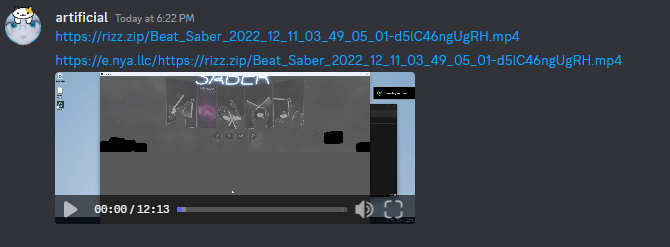

<h1 align="center">stolen embeds</h1>

  

Built with itty-router and cloudflare workers, this allows embedding unusual videos in Discord, such as 100+ megabyte videos or AV1-encoded videos.

Inspired by [stolen.shoes](https://stolen.shoes/) and [FixTweet](https://github.com/FixTweet/FxTwitter).

## Usage
Put `https://emb.arti.lol/` in front of the video URL, like so:
`https://emb.arti.lol/https://files.arti.lol/American_Psycho_LQ-YKZb0fPxBDZM.mp4`

If the video URL has a [query string](https://en.wikipedia.org/wiki/Query_string), you'll need to [url encode it](https://meyerweb.com/eric/tools/dencoder/).
